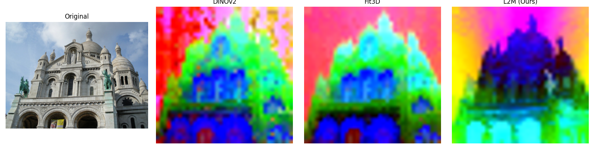
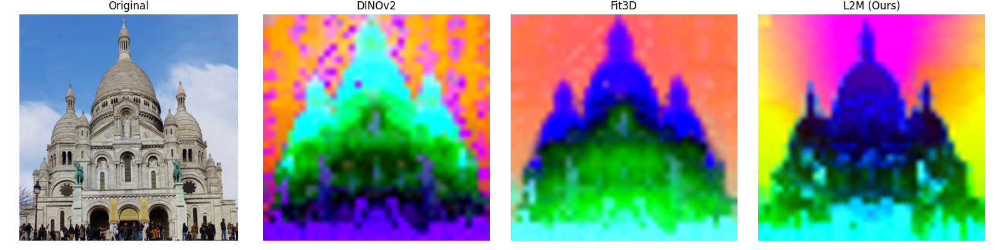
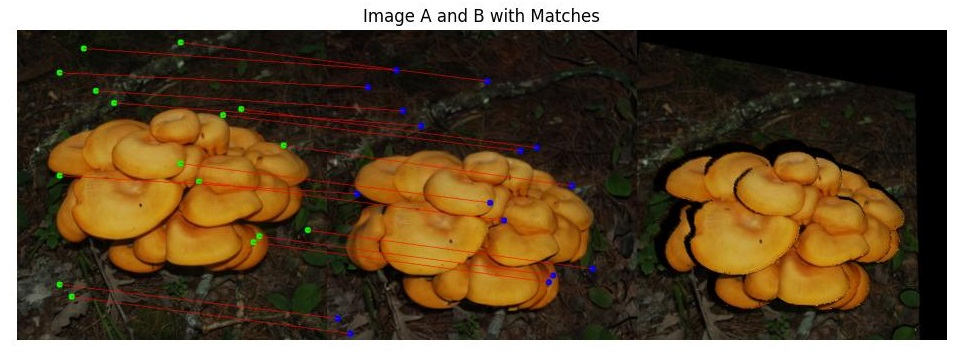
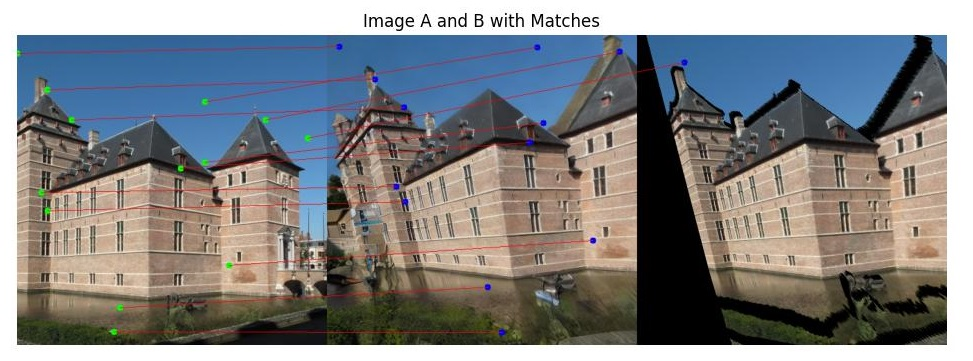

# Learning Dense Feature Matching via Lifting Single 2D Image to 3D Space


Welcome to the **L2M** repository! This is the official implementation of our ICCV'25 paper titled "Learning Dense Feature Matching via Lifting Single 2D Image to 3D Space".

*Accepted to ICCV 2025 Conference*

---

> 🚨 **Important Notice:**  
> This repository is the **official implementation** of the ICCV 2025 paper authored by Sharpiless.  
>  
> Please be aware that the repository at [https://github.com/chelseaaxy/L2M](https://github.com/chelseaaxy/L2M) is **NOT an official implementation** and is not authorized by the original authors.  
>  
> Always refer to this repository for the authentic and up-to-date code.


## 🧠 Overview

**Lift to Match (L2M)** is a two-stage framework for **dense feature matching** that lifts 2D images into 3D space to enhance feature generalization and robustness. Unlike traditional methods that depend on multi-view image pairs, L2M is trained on large-scale, diverse single-view image collections.

- **Stage 1:** Learn a **3D-aware ViT-based encoder** using multi-view image synthesis and 3D Gaussian feature representation.
- **Stage 2:** Learn a **feature decoder** through novel-view rendering and synthetic data, enabling robust matching across diverse scenarios.

> 🚧 Code is still under construction.

---

## 🧪 Feature Visualization

We compare the 3D-aware ViT encoder from L2M (Stage 1) with other recent methods:

- **DINOv2**: Learning Robust Visual Features without Supervision
- **FiT3D**: Improving 2D Feature Representations by 3D-Aware Fine-Tuning
- **Ours: L2M Encoder**

You can download them from the [Releases](https://github.com/Sharpiless/L2M/releases/tag/checkpoints) page.

<div align="center">
  
  <br/>
</div>

<div align="center">
  
  <br/>
</div>

---

To get the results, make sure your checkpoints and image files are in the correct paths, then run:
```
python vis_feats.py \
  --img_paths assets/sacre_coeur_A.jpg assets/sacre_coeur_B.jpg \
  --ckpt_dino ckpts/dinov2.pth \
  --ckpt_fit3d ckpts/fit3d.pth \
  --ckpt_L2M ckpts/l2m_vit_base.pth \
  --save_dir outputs_vis_feat
```

## 🏗️ Data Generation

To enable training from single-view images, we simulate diverse multi-view observations and their corresponding dense correspondence labels in a fully automatic manner.

#### Stage 2.1: Novel View Synthesis
We lift a single-view image to a coarse 3D structure and then render novel views from different camera poses. These synthesized multi-view images are used to supervise the feature encoder with dense matching consistency.

Run the following to generate novel-view images with ground-truth dense correspondences:
```
python get_data.py \
  --output_path [PATH-to-SAVE] \
  --data_path [PATH-to-IMAGES] \
  --disp_path [PATH-to-MONO-DEPTH]
```

This code provides an example on novel view generation with dense matching ground truth.

The disp_path should contain grayscale disparity maps predicted by Depth Anything V2 or another monocular depth estimator.

Below are examples of synthesized novel views with ground-truth dense correspondences, generated in Stage 2.1:

<div align="center">   </div> <br/>


These demonstrate both the geometric diversity and high-quality pixel-level correspondence labels used for supervision.

For novel-view inpainting, we also provide a better inpainting model fine-tuned from Stable-Diffusion-2.0-Inpainting:

```
from diffusers import StableDiffusionInpaintPipeline
import torch
from diffusers.utils import load_image, make_image_grid
import PIL

# 指定模型文件路径
model_path = "Liangyingping/L2M-Inpainting"  # 替换为你自己的模型路径

# 加载模型
pipe = StableDiffusionInpaintPipeline.from_pretrained(
    model_path, torch_dtype=torch.float16
)
pipe.to("cuda")  # 如果有 GPU，可以将模型加载到 GPU 上

init_image = load_image("assets/debug_masked_image.png")
mask_image = load_image("assets/debug_mask.png")
W, H = init_image.size

prompt = "a photo of a person"
image = pipe(
    prompt=prompt,
    image=init_image,
    mask_image=mask_image,
    h=512, w=512
).images[0].resize((W, H))

print(image.size, init_image.size)

image2save = make_image_grid([init_image, mask_image, image], rows=1, cols=3)
image2save.save("image2save_ours.png")
```

Or you can manually download the model from [hugging-face](https://huggingface.co/Liangyingping/L2M-Inpainting).


#### Stage 2.2: Relighting for Appearance Diversity
To improve feature robustness under varying lighting conditions, we apply a physics-inspired relighting pipeline to the synthesized 3D scenes.

Run the following to generate relit image pairs for training the decoder:
```
python relight.py
```
All outputs will be saved under the configured output directory, including original view, novel views, and their camera metrics with dense depth.

#### Stage 2.3: Sky Masking (Optional)

If desired, you can run sky_seg.py to mask out sky regions, which are typically textureless and not useful for matching. This can help reduce noise and focus training on geometrically meaningful regions.

```
python sky_seg.py
```


## 🙋‍♂️ Acknowledgements

We build upon recent advances in [ROMA](https://github.com/Parskatt/RoMa), [GIM](https://github.com/xuelunshen/gim), and [FiT3D](https://github.com/ywyue/FiT3D).
